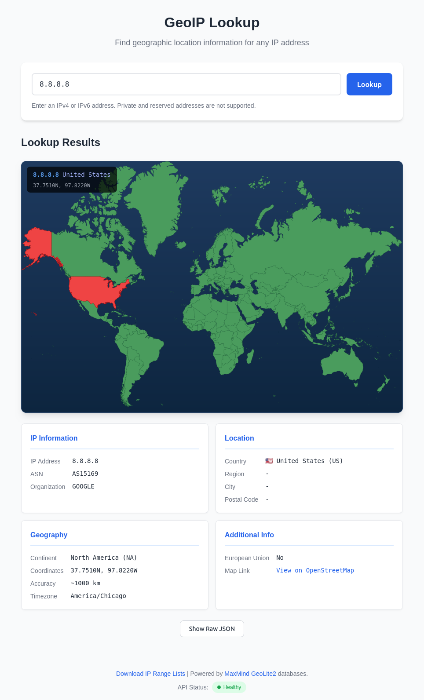
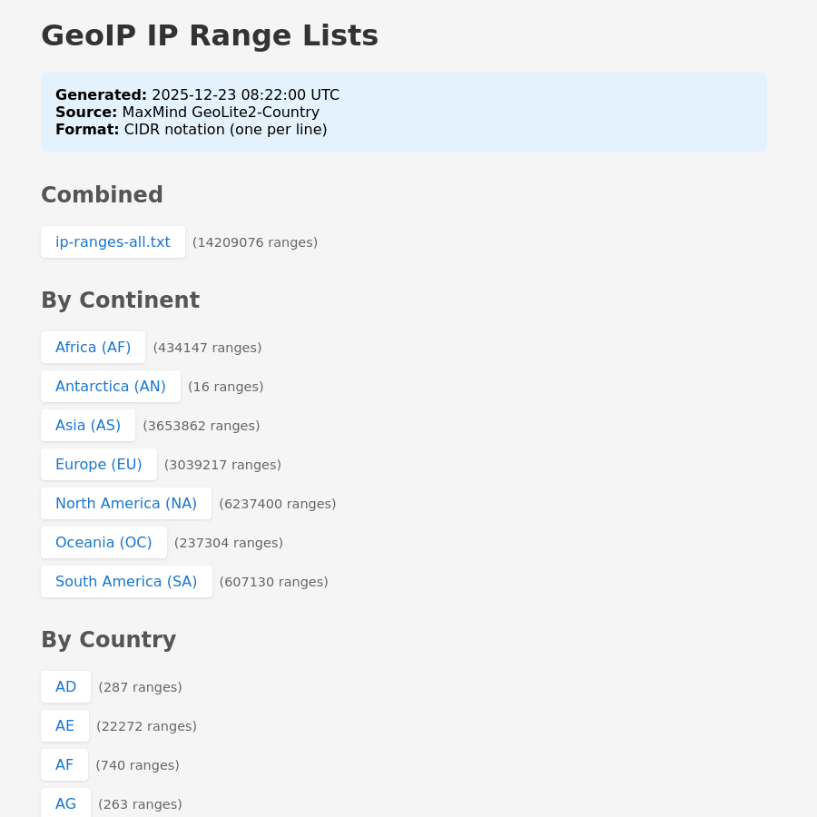

# GeoIP Lookup System

A complete, containerized IP geolocation lookup system using MaxMind GeoLite2 databases. This system provides a REST API and web interface for looking up geographic information associated with IP addresses.




## System Architecture

```
                                    +-------------------+
                                    |   MaxMind CDN     |
                                    | (Database Source) |
                                    +--------+----------+
                                             |
                                             | Downloads databases
                                             v
+-------------------+              +-------------------+
|                   |              |                   |
|   geoip-updater   |------------->|   geoip-data      |
|   (maxmindinc/    |   writes     |   (shared volume) |
|    geoipupdate)   |              |                   |
|                   |              +--------+----------+
+-------------------+                       |
                                            | reads (read-only)
                                            v
+-------------------+              +-------------------+
|                   |              |                   |
|   geoip-webui     |<------------>|   geoip-api       |
|   (Nginx)         |   proxies    |   (FastAPI)       |
|   Port: 8080      |   /api/*     |   Port: 8000      |
|                   |              |                   |
+-------------------+              +-------------------+
        ^
        |
   Web Browser
```

### Components

1. **geoip-updater**: Runs the official MaxMind `geoipupdate` tool to download and keep GeoLite2 databases current
2. **geoip-api**: FastAPI-based REST API that reads the databases and provides lookup endpoints
3. **geoip-webui**: Nginx-powered web frontend that serves static files and proxies API requests

## Prerequisites

- Docker Engine 20.10+
- Docker Compose 2.0+
- Free MaxMind GeoLite2 account (for database access)

## Quick Start

### 1. Get MaxMind License Key

1. Sign up for a free account at [MaxMind GeoLite2](https://www.maxmind.com/en/geolite2/signup)
2. Log in to your account
3. Go to **Account > Manage License Keys**
4. Click **Generate new license key**
5. Save your Account ID and License Key

### 2. Configure the Environment

```bash
# Clone or navigate to the project directory
cd geoip_new

# Copy the example environment file
cp .env.example .env

# Edit .env with your MaxMind credentials
nano .env
```

Update these values in `.env`:
```bash
GEOIPUPDATE_ACCOUNT_ID=your_account_id_here
GEOIPUPDATE_LICENSE_KEY=your_license_key_here
```

### 3. Start the System

```bash
# Build and start all services
docker-compose up -d

# View logs
docker-compose logs -f
```

### 4. Access the System

- **Web Interface**: http://localhost:8080
- **API Direct Access**: http://localhost:8000
- **API Documentation**: http://localhost:8000/docs

## Configuration Options

### Environment Variables

| Variable | Default | Description |
|----------|---------|-------------|
| `GEOIPUPDATE_ACCOUNT_ID` | (required) | Your MaxMind account ID |
| `GEOIPUPDATE_LICENSE_KEY` | (required) | Your MaxMind license key |
| `GEOIPUPDATE_EDITION_IDS` | `GeoLite2-ASN GeoLite2-City GeoLite2-Country` | Databases to download |
| `GEOIPUPDATE_FREQUENCY` | `24` | Update check interval in hours |
| `API_HOST` | `0.0.0.0` | API bind address |
| `API_PORT` | `8000` | API port |
| `API_LOG_LEVEL` | `info` | Logging level (debug, info, warning, error) |
| `WEBUI_PORT` | `8080` | Web interface port |

### Changing Ports

To use different ports, update your `.env` file:

```bash
API_PORT=3000
WEBUI_PORT=80
```

Then update the port mappings in `docker-compose.yml` if needed.

## API Documentation

### Endpoints

#### GET /lookup/{ip}

Look up geolocation information for an IP address.

**Request:**
```bash
curl http://localhost:8000/lookup/8.8.8.8
```

**Response:**
```json
{
  "ip": "8.8.8.8",
  "country_code": "US",
  "country_name": "United States",
  "subdivision_code": null,
  "subdivision_name": null,
  "city_name": null,
  "postal_code": null,
  "latitude": 37.751,
  "longitude": -97.822,
  "accuracy_radius": 1000,
  "timezone": "America/Chicago",
  "asn": 15169,
  "asn_org": "GOOGLE",
  "is_in_european_union": false,
  "continent_code": "NA",
  "continent_name": "North America"
}
```

**Error Responses:**

- `400 Bad Request` - Invalid IP address format or private IP
- `404 Not Found` - IP not found in database
- `503 Service Unavailable` - Database not loaded yet

#### GET /health

Health check endpoint for monitoring.

**Response:**
```json
{
  "status": "healthy",
  "databases_loaded": true,
  "city_db_available": true,
  "asn_db_available": true,
  "country_db_available": true,
  "last_load_time": "2024-01-15T10:30:00",
  "message": "All systems operational"
}
```

#### GET /reload

Manually trigger database reload.

**Response:**
```json
{
  "status": "success",
  "message": "Databases reloaded successfully"
}
```

#### GET /network/{ip}

Get the actual network/subnet for an IP address from the ASN database.

**Request:**
```bash
curl http://localhost:8000/network/8.8.8.8
```

**Response:**
```json
{
  "ip": "8.8.8.8",
  "network": "8.8.8.0/24",
  "asn": 15169,
  "asn_org": "GOOGLE"
}
```

**Error Responses:**

- `400 Bad Request` - Invalid IP address format or private IP
- `404 Not Found` - Network information not found for IP
- `503 Service Unavailable` - ASN database not available

## Troubleshooting

### Databases Not Loading

If the API shows "Waiting for database files":

1. **Check updater logs:**
   ```bash
   docker-compose logs geoip-updater
   ```

2. **Verify credentials:**
   - Ensure `GEOIPUPDATE_ACCOUNT_ID` and `GEOIPUPDATE_LICENSE_KEY` are correct
   - Make sure your MaxMind license key has GeoLite2 permissions

3. **Check volume:**
   ```bash
   docker volume inspect geoip-data
   docker run --rm -v geoip-data:/data alpine ls -la /data
   ```

### API Not Responding

1. **Check API health:**
   ```bash
   docker-compose exec geoip-api curl http://localhost:8000/health
   ```

2. **View API logs:**
   ```bash
   docker-compose logs geoip-api
   ```

3. **Restart the API:**
   ```bash
   docker-compose restart geoip-api
   ```

### WebUI Not Loading

1. **Check nginx status:**
   ```bash
   docker-compose logs geoip-webui
   ```

2. **Verify API connectivity:**
   ```bash
   docker-compose exec geoip-webui curl http://geoip-api:8000/health
   ```

### Common Errors

| Error | Cause | Solution |
|-------|-------|----------|
| "Invalid IP address format" | Malformed IP input | Enter a valid IPv4 or IPv6 address |
| "Cannot look up private IP" | Reserved IP range | Use a public IP address |
| "Database not available" | Files not downloaded yet | Wait for updater to complete |
| "IP not found in database" | IP not in MaxMind data | Normal for some IPs, especially new ones |

## Verifying the System

### Quick Test

```bash
# Test the API directly
curl http://localhost:8000/lookup/8.8.8.8

# Test through the WebUI proxy
curl http://localhost:8080/api/lookup/8.8.8.8

# Check system health
curl http://localhost:8000/health
```

### Test IPs

Use these well-known IPs for testing:

| IP Address | Expected Location |
|------------|-------------------|
| 8.8.8.8 | United States (Google DNS) |
| 1.1.1.1 | Australia (Cloudflare) |
| 208.67.222.222 | United States (OpenDNS) |
| 77.88.8.8 | Russia (Yandex) |

## Authentication

The WebUI is protected with basic authentication. Whitelisted IPs can access without credentials.

### Default Credentials

| Username | Password |
|----------|----------|
| `geoip` | `geoip123` |

### Default Whitelisted IPs

These IPs/ranges can access without authentication:

| Range | Description |
|-------|-------------|
| `127.0.0.1`, `::1` | Localhost |
| `10.0.0.0/8` | Private network |
| `172.16.0.0/12` | Private network (Docker) |
| `192.168.0.0/16` | Private network |

### Adding Allowed IPs

Edit `webui/allow_ips.conf` to add IPs that can bypass authentication:

```bash
# Edit the whitelist
nano webui/allow_ips.conf
```

Add entries in nginx format:
```nginx
# Single IP
allow 203.0.113.50;

# CIDR range
allow 198.51.100.0/24;

# IPv6
allow 2001:db8::/32;
```

Apply changes:
```bash
docker compose restart geoip-webui
```

### Changing Password

Generate a new password and rebuild:

```bash
# Generate new htpasswd entry
echo "username:$(openssl passwd -apr1 'newpassword')" > webui/htpasswd

# Rebuild and deploy
docker compose build geoip-webui
docker compose up -d geoip-webui
```

### Public Endpoints

These endpoints are accessible without authentication:

| Endpoint | Purpose |
|----------|---------|
| `/script/*` | Downloadable scripts |
| `/nginx-health` | Health check |

## Connection Analyzer Script

A ready-to-use bash script that analyzes active server connections and enriches them with GeoIP data. Perfect for identifying top connecting IPs and their geographic origins.

### Usage

Run directly on any server with `curl` and `netstat`:

```bash
# Set your GeoIP server address
export GEOIP_SERVER="geoip.example.com:8080"

# Default: show top 10 IPs and subnets
curl <your-geoip-server>/script/con_analyzer_auth.sh | bash -

# Custom count: show top 20
curl <your-geoip-server>/script/con_analyzer_auth.sh | bash -s -- 20

# One-liner with inline server config
curl <your-geoip-server>/script/con_analyzer_auth.sh | GEOIP_SERVER="geoip.example.com:8080" bash -
```

### Basic Authentication

If your GeoIP server requires authentication, set the `GEOIP_USER` and `GEOIP_PASS` environment variables:

```bash
# With basic auth credentials
curl <your-geoip-server>/script/con_analyzer_auth.sh | \
  GEOIP_SERVER="geoip.example.com:8080" \
  GEOIP_USER="geoip" \
  GEOIP_PASS="yourpassword" \
  bash -

# Or export them first
export GEOIP_SERVER="geoip.example.com:8080"
export GEOIP_USER="geoip"
export GEOIP_PASS="yourpassword"
curl <your-geoip-server>/script/con_analyzer_auth.sh | bash -
```

### Environment Variables

| Variable | Required | Default | Description |
|----------|----------|---------|-------------|
| `GEOIP_SERVER` | Yes | - | GeoIP server address (e.g., `geoip.example.com`) |
| `GEOIP_PROTO` | No | `https` | Protocol: `http` or `https` |
| `GEOIP_USER` | No | - | Basic auth username |
| `GEOIP_PASS` | No | - | Basic auth password |

### Features

- Analyzes active connections on ports **80** and **443**
- Supports both **IPv4** and **IPv6** addresses
- Groups connections by:
  - Individual IP addresses
  - IPv4 subnets (/24)
  - IPv6 prefixes (/48)
- Filters out private/local addresses automatically
- Enriches data with country, ASN, and organization info

### Example Output

```
TOP 10 IPv4 connections (port 80/443)
-------- ---------------------------------------- ----- -------------------- ---------- --------------------
COUNT    IP                                       CC    COUNTRY              ASN        ASN_NAME
-------- ---------------------------------------- ----- -------------------- ---------- --------------------
152      203.0.113.45                             US    United States        15169      GOOGLE
89       198.51.100.23                            DE    Germany              3320       DTAG
45       192.0.2.100                              GB    United Kingdom       5089       NTL

TOP 10 IPv4 subnets /24 (port 80/443)
-------- ---------------------------------------- ----- -------------------- ---------- --------------------
COUNT    IP                                       CC    COUNTRY              ASN        ASN_NAME
-------- ---------------------------------------- ----- -------------------- ---------- --------------------
312      203.0.113.45                             US    United States        15169      GOOGLE
156      198.51.100.23                            DE    Germany              3320       DTAG

TOP 10 IPv6 connections (port 80/443)
-------- ---------------------------------------- ----- -------------------- ---------- --------------------
COUNT    IP                                       CC    COUNTRY              ASN        ASN_NAME
-------- ---------------------------------------- ----- -------------------- ---------- --------------------
23       2607:f8b0:4004:800::200e                 US    United States        15169      GOOGLE
```

### Requirements

The target server needs:
- `bash`
- `curl`
- `netstat` (from `net-tools` package)
- Network access to your GeoIP server

### Filtered Addresses

The script automatically excludes:

**IPv4:**
- `127.0.0.0/8` (loopback)
- `10.0.0.0/8` (private)
- `172.16.0.0/12` (private)
- `192.168.0.0/16` (private)

**IPv6:**
- `::1` (loopback)
- `fe80::/10` (link-local)
- `fc00::/7` (unique local)

## Production Deployment

### Security Considerations

1. **Restrict CORS**: Update `api/main.py` to limit `allow_origins` to your domain
2. **HTTPS**: Add a reverse proxy (Traefik, Caddy) for TLS termination
3. **Rate Limiting**: Nginx is configured with basic rate limiting; adjust as needed
4. **Network Isolation**: Consider using internal networks for API-to-WebUI communication

### Scaling

- The API service is stateless and can be horizontally scaled
- Use Docker Swarm or Kubernetes for multi-instance deployments
- Consider adding Redis caching for high-traffic scenarios

### Monitoring

- All services include health checks for orchestration
- API exposes `/health` endpoint for monitoring systems
- Enable structured logging with `API_LOG_LEVEL=info`

## Maintenance

### Updating Databases Manually

```bash
# Restart the updater to force an immediate update
docker-compose restart geoip-updater

# Then reload the API to pick up new files
curl http://localhost:8000/reload
```

### Updating Container Images

```bash
# Pull latest base images and rebuild
docker-compose build --no-cache
docker-compose up -d
```

### Viewing Logs

```bash
# All services
docker-compose logs -f

# Specific service
docker-compose logs -f geoip-api

# Last 100 lines
docker-compose logs --tail=100 geoip-api
```

### Stopping the System

```bash
# Stop all services (preserves data)
docker-compose down

# Stop and remove all data
docker-compose down -v
```

## File Structure

```
geoip_new/
|-- docker-compose.yml      # Service orchestration
|-- .env.example            # Environment template
|-- .env                    # Your configuration (git-ignored)
|-- .gitignore              # Git ignore rules
|-- .dockerignore           # Docker build ignore rules
|-- README.md               # This file
|-- api/
|   |-- Dockerfile          # API container build
|   |-- main.py             # FastAPI application
|   |-- requirements.txt    # Python dependencies
|-- webui/
    |-- Dockerfile          # WebUI container build
    |-- nginx.conf          # Nginx configuration
    |-- htpasswd            # Basic auth credentials
    |-- allow_ips.conf      # IP whitelist (editable)
    |-- index.html          # Main HTML page
    |-- styles.css          # Stylesheet
    |-- app.js              # Frontend JavaScript
    |-- scripts/
        |-- con_analyzer_auth.sh  # Connection analyzer script
```

## License

This project is licensed under the [Apache License 2.0](https://www.apache.org/licenses/LICENSE-2.0).

This project uses MaxMind GeoLite2 databases, which are provided under the [GeoLite2 End User License Agreement](https://www.maxmind.com/en/geolite2/eula).

## Acknowledgments

- [MaxMind](https://www.maxmind.com/) for providing the GeoLite2 databases
- [FastAPI](https://fastapi.tiangolo.com/) for the excellent Python web framework
- [geoip2](https://github.com/maxmind/GeoIP2-python) Python library for database access
